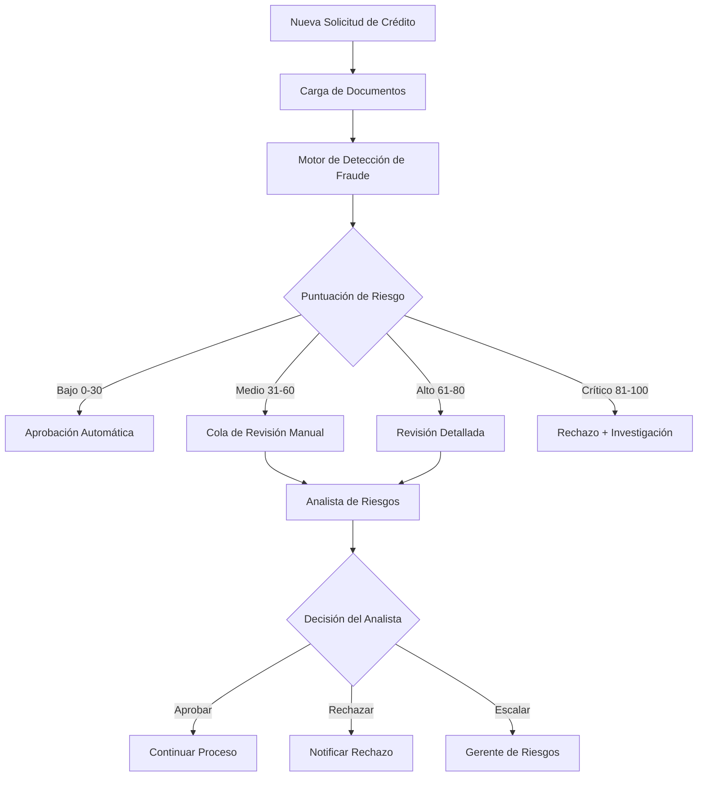

# Product Requirements Document (PRD)
# Sistema de Detección de Fraude y Departamento de Riesgos

**Versión:** 1.0  
**Fecha:** 20 de Diciembre, 2025  
**Autor:** Equipo de Producto - Finkargo  
**Estado:** En Revisión

## 1. Resumen Ejecutivo

### 1.1 Objetivo
Implementar un sistema automatizado de detección de fraude integrado en un nuevo departamento de "Riesgos" dentro del Finkargo Automation Hub, basado en el análisis del caso de fraude Azelis y diseñado para prevenir futuros intentos de fraude similares.

### 1.2 Problema a Resolver
El caso Azelis demostró vulnerabilidades en el proceso de verificación de clientes:
- Uso de identidades legítimas con empresas falsas
- Documentos financieros falsificados profesionalmente
- Dominios de email similares pero fraudulentos
- Falta de validación cruzada entre documentos

### 1.3 Solución Propuesta
Un módulo de Riesgos que automatice la detección de patrones fraudulentos mediante:
- Validación cruzada de documentos en tiempo real
- Sistema de puntuación de riesgo
- Alertas automáticas para casos sospechosos
- Interfaz dedicada para el equipo de riesgos

## 2. Alcance del Proyecto

### 2.1 En el Alcance
- ✅ Nuevo departamento "Riesgos" en el menú principal
- ✅ Sistema de validación automática de documentos
- ✅ Motor de reglas de detección de fraude
- ✅ Dashboard de monitoreo de riesgos
- ✅ Sistema de alertas y notificaciones
- ✅ Integración con flujos existentes de solicitudes de crédito
- ✅ Historial de evaluaciones de riesgo
- ✅ Gestión de listas negras/watchlists

### 2.2 Fuera del Alcance
- ❌ Integración con bureaus de crédito externos (fase 2)
- ❌ Machine Learning avanzado (fase 3)
- ❌ Verificación biométrica (proyecto separado)
- ❌ Modificación de procesos legales existentes

## 3. Usuarios y Stakeholders

### 3.1 Usuarios Principales
- **Analistas de Riesgos**: Revisión y aprobación de casos
- **Gerentes de Riesgos**: Configuración de reglas y umbrales
- **Equipo Comercial**: Visibilidad del estado de riesgo
- **Administradores**: Gestión del sistema

### 3.2 Stakeholders
- **CFO**: Sponsor del proyecto
- **Legal**: Cumplimiento normativo
- **Operations**: Integración con procesos
- **IT Security**: Seguridad de datos

## 4. Requisitos Funcionales

### 4.1 Módulo de Departamento de Riesgos

#### 4.1.1 Navegación y Acceso
```typescript
// Nueva entrada en el menú principal
{
  title: 'Riesgos',
  icon: <SecurityIcon />,
  path: '/riesgos',
  allowedRoles: ['admin', 'risk_analyst', 'risk_manager']
}
```

#### 4.1.2 Dashboard Principal
- **Métricas en Tiempo Real**:
  - Solicitudes en evaluación
  - Alertas activas por nivel de riesgo
  - Tasa de aprobación/rechazo
  - Tendencias de fraude detectado

- **Componentes del Dashboard**:
  ```
  ┌─────────────────────────────────────────────┐
  │  Resumen de Riesgos (Últimas 24h)          │
  ├─────────────┬─────────────┬────────────────┤
  │ Alto: 3     │ Medio: 12   │ Bajo: 45      │
  ├─────────────┴─────────────┴────────────────┤
  │  Alertas Activas                            │
  │  • AZELIS_COPY - Score: 85/100             │
  │  • INVALID_NIT - Score: 72/100             │
  └─────────────────────────────────────────────┘
  ```

### 4.2 Motor de Detección de Fraude

#### 4.2.1 Validaciones Automáticas

**1. Validación de Coherencia de Identidad**
```python
def validate_identity_consistency(documents: Dict) -> RiskScore:
    """
    Verifica que la identidad sea consistente en todos los documentos
    """
    # Extraer información de:
    # - Cédula/ID
    # - RUT
    # - Estados financieros
    # - Certificaciones bancarias
    
    inconsistencies = []
    
    # Verificar nombre de empresa
    if id_company != rut_company:
        inconsistencies.append({
            'type': 'COMPANY_NAME_MISMATCH',
            'severity': 'HIGH',
            'details': f'ID: {id_company}, RUT: {rut_company}'
        })
    
    # Verificar NIT
    if not validate_nit_format(nit):
        inconsistencies.append({
            'type': 'INVALID_NIT',
            'severity': 'CRITICAL',
            'details': 'NIT format invalid'
        })
    
    return calculate_risk_score(inconsistencies)
```

**2. Validación de Dominios de Email**
```python
def validate_email_domains(email: str, company_name: str) -> RiskAlert:
    """
    Detecta dominios sospechosos similares a empresas legítimas
    """
    # Lista de empresas conocidas y sus dominios
    known_companies = {
        'azelis': ['azelis.com', 'azelis-americas.com'],
        'basf': ['basf.com', 'basf.co'],
        # ... más empresas
    }
    
    # Detectar similitudes sospechosas
    # Ej: acelis.com.co vs azelis.com
    
    if is_suspicious_domain(email, known_companies):
        return RiskAlert(
            level='HIGH',
            message='Possible domain spoofing detected'
        )
```

**3. Validación de Documentos Financieros**
```python
def validate_financial_documents(financial_statements: Document) -> ValidationResult:
    """
    Verifica autenticidad de estados financieros
    """
    checks = {
        'auditor_verification': verify_auditor_license(),
        'date_consistency': check_timeline_logic(),
        'calculation_accuracy': verify_financial_calculations(),
        'format_authenticity': check_document_format()
    }
    
    return aggregate_validation_results(checks)
```

#### 4.2.2 Sistema de Puntuación de Riesgo

**Matriz de Riesgo:**
| Factor de Riesgo | Peso | Puntuación Máxima |
|-----------------|------|-------------------|
| Inconsistencia de Identidad | 35% | 35 puntos |
| Dominio Email Sospechoso | 25% | 25 puntos |
| Documentos Financieros | 20% | 20 puntos |
| Historial de Empresa | 10% | 10 puntos |
| Verificación de Direcciones | 10% | 10 puntos |
| **Total** | **100%** | **100 puntos** |

**Niveles de Riesgo:**
- 🟢 **Bajo** (0-30): Aprobación automática
- 🟡 **Medio** (31-60): Revisión manual requerida
- 🔴 **Alto** (61-80): Revisión detallada + verificaciones adicionales
- 🚫 **Crítico** (81-100): Rechazo automático + investigación

### 4.3 Flujo de Trabajo de Evaluación



### 4.4 Interfaz de Usuario - Pantallas Principales

#### 4.4.1 Vista de Evaluación de Riesgo
```typescript
interface RiskEvaluationView {
  // Información del Cliente
  clientInfo: {
    companyName: string;
    nit: string;
    legalRepresentative: string;
    applicationDate: Date;
  };
  
  // Resultados de Validación
  validationResults: {
    overallScore: number;
    riskLevel: 'LOW' | 'MEDIUM' | 'HIGH' | 'CRITICAL';
    detectedIssues: Issue[];
    documentAnalysis: DocumentValidation[];
  };
  
  // Acciones Disponibles
  actions: {
    approve: boolean;
    reject: boolean;
    escalate: boolean;
    requestAdditionalDocs: boolean;
  };
}
```

#### 4.4.2 Panel de Configuración de Reglas
- Editor visual de reglas de negocio
- Gestión de umbrales de riesgo
- Configuración de pesos por factor
- Gestión de listas negras/watchlists

### 4.5 Integraciones

#### 4.5.1 Integración con Módulo Legal
```python
# Hook en el proceso de generación de contratos
@risk_validation_required
async def generate_contract(client_data: ClientData):
    risk_assessment = await risk_service.evaluate_client(client_data)
    
    if risk_assessment.level == 'CRITICAL':
        raise FraudDetectedException("High risk client detected")
    
    if risk_assessment.level in ['HIGH', 'MEDIUM']:
        await notify_risk_team(risk_assessment)
        await wait_for_approval(risk_assessment.id)
    
    # Continuar con generación normal
    return await contract_service.generate(client_data)
```

#### 4.5.2 Base de Datos - Nuevas Tablas

```sql
-- Tabla de evaluaciones de riesgo
CREATE TABLE risk_assessments (
    id UUID PRIMARY KEY DEFAULT gen_random_uuid(),
    client_id UUID REFERENCES clients(id),
    application_type VARCHAR(50) NOT NULL,
    overall_score INTEGER NOT NULL,
    risk_level VARCHAR(20) NOT NULL,
    validation_details JSONB NOT NULL,
    detected_issues JSONB,
    analyst_notes TEXT,
    status VARCHAR(50) DEFAULT 'pending',
    decision VARCHAR(50),
    decided_by UUID REFERENCES user_profiles(id),
    created_at TIMESTAMPTZ DEFAULT NOW(),
    updated_at TIMESTAMPTZ DEFAULT NOW()
);

-- Tabla de reglas de detección
CREATE TABLE fraud_detection_rules (
    id UUID PRIMARY KEY DEFAULT gen_random_uuid(),
    rule_name VARCHAR(100) NOT NULL,
    rule_type VARCHAR(50) NOT NULL,
    conditions JSONB NOT NULL,
    weight DECIMAL(3,2) NOT NULL,
    severity VARCHAR(20) NOT NULL,
    is_active BOOLEAN DEFAULT true,
    created_by UUID REFERENCES user_profiles(id),
    created_at TIMESTAMPTZ DEFAULT NOW()
);

-- Tabla de lista negra
CREATE TABLE risk_blacklist (
    id UUID PRIMARY KEY DEFAULT gen_random_uuid(),
    entity_type VARCHAR(50) NOT NULL, -- 'company', 'person', 'email_domain'
    entity_value VARCHAR(255) NOT NULL,
    reason TEXT NOT NULL,
    risk_level VARCHAR(20) NOT NULL,
    added_by UUID REFERENCES user_profiles(id),
    added_date TIMESTAMPTZ DEFAULT NOW(),
    is_active BOOLEAN DEFAULT true,
    UNIQUE(entity_type, entity_value)
);

-- Índices para búsqueda rápida
CREATE INDEX idx_risk_assessments_client ON risk_assessments(client_id);
CREATE INDEX idx_risk_assessments_status ON risk_assessments(status);
CREATE INDEX idx_blacklist_entity ON risk_blacklist(entity_type, entity_value);
```

## 5. Requisitos No Funcionales

### 5.1 Rendimiento
- Evaluación de riesgo < 3 segundos
- Dashboard carga < 2 segundos
- Procesamiento OCR < 5 segundos por documento

### 5.2 Seguridad
- Encriptación de documentos sensibles
- Logs de auditoría para todas las decisiones
- Acceso basado en roles (RBAC)
- Cumplimiento con regulaciones colombianas

### 5.3 Escalabilidad
- Soporte para 1000+ evaluaciones diarias
- Arquitectura de microservicios
- Cola de procesamiento asíncrono

### 5.4 Disponibilidad
- 99.5% uptime
- Backup automático de reglas
- Recuperación ante desastres

## 6. Casos de Uso Detallados

### 6.1 Caso de Uso: Detección de Fraude Tipo Azelis

**Actor:** Sistema Automatizado  
**Precondición:** Cliente sube documentos para solicitud de crédito  
**Flujo Principal:**

1. Sistema recibe documentos (ID, RUT, Estados Financieros)
2. OCR extrae información clave:
   - Nombre de empresa en ID: "ROCSA COLOMBIA S.A."
   - Nombre en RUT: "AZELIS COLOMBIA S.A.S."
   - NIT: 830.027.231-3
3. Sistema detecta inconsistencia de nombres
4. Sistema verifica dominio de email contra lista de empresas conocidas
5. Sistema calcula puntuación de riesgo: 85/100 (CRÍTICO)
6. Sistema genera alerta automática
7. Sistema bloquea la solicitud y notifica al equipo de riesgos

**Postcondición:** Fraude prevenido, caso en investigación

### 6.2 Caso de Uso: Revisión Manual por Analista

**Actor:** Analista de Riesgos  
**Precondición:** Solicitud marcada para revisión manual (score 45/100)  
**Flujo Principal:**

1. Analista accede al dashboard de riesgos
2. Selecciona caso pendiente de la cola
3. Revisa detalle de validaciones:
   - ⚠️ Fecha de estados financieros futura
   - ✅ NIT válido
   - ✅ Documentos con formato correcto
4. Analista solicita documentación adicional
5. Cliente proporciona certificación bancaria
6. Sistema re-evalúa con nuevos documentos
7. Analista aprueba con condiciones
8. Sistema registra decisión y continúa proceso

**Postcondición:** Solicitud aprobada con mitigaciones

## 7. Mockups y Diseños

### 7.1 Dashboard de Riesgos
```
┌─────────────────────────────────────────────────────────┐
│ 🛡️ Departamento de Riesgos                              │
├─────────────────────────────────────────────────────────┤
│ ┌─────────────┬─────────────┬─────────────┬───────────┐ │
│ │ En Revisión │   Alertas   │  Aprobados  │ Rechazados│ │
│ │     23      │     5       │     156     │    12     │ │
│ └─────────────┴─────────────┴─────────────┴───────────┘ │
│                                                          │
│ 📊 Distribución de Riesgos (Última Semana)              │
│ ┌────────────────────────────────────────────────────┐  │
│ │ ██████████████░░░░░ 75% Bajo                      │  │
│ │ ████░░░░░░░░░░░░░░░ 20% Medio                     │  │
│ │ █░░░░░░░░░░░░░░░░░░  5% Alto/Crítico              │  │
│ └────────────────────────────────────────────────────┘  │
│                                                          │
│ 🚨 Alertas Recientes                                     │
│ ┌────────────────────────────────────────────────────┐  │
│ │ • TECH_SOLUTIONS_SAS - Score: 78 - Dominio sosp.  │  │
│ │ • IMPORT_EXPERT_LTDA - Score: 65 - Doc. incons.   │  │
│ │ • GLOBAL_TRADE_CO - Score: 82 - En lista negra    │  │
│ └────────────────────────────────────────────────────┘  │
└─────────────────────────────────────────────────────────┘
```

### 7.2 Vista de Evaluación Detallada
```
┌─────────────────────────────────────────────────────────┐
│ Evaluación de Riesgo - TECH_SOLUTIONS_SAS               │
├─────────────────────────────────────────────────────────┤
│ Score Total: 78/100 🔴 ALTO RIESGO                      │
│                                                          │
│ 📋 Información del Cliente                              │
│ • Empresa: TECH SOLUTIONS S.A.S.                        │
│ • NIT: 900.123.456-7                                    │
│ • Representante: Juan Pérez                             │
│ • Fecha Solicitud: 20/12/2025                           │
│                                                          │
│ 🔍 Resultados de Validación                             │
│ ┌────────────────────────────────────────────────────┐  │
│ │ ❌ Inconsistencia de Identidad         [35/35]     │  │
│ │    → Nombre en CC: GLOBAL TECH S.A.                │  │
│ │    → Nombre en RUT: TECH SOLUTIONS S.A.S.          │  │
│ │                                                     │  │
│ │ ⚠️  Dominio Email Sospechoso          [20/25]     │  │
│ │    → techsolutions@tech-solution.co                 │  │
│ │    → Similar a: techsolutions.com (legítimo)       │  │
│ │                                                     │  │
│ │ ✅ Documentos Financieros             [10/20]      │  │
│ │ ✅ Historial de Empresa               [8/10]       │  │
│ │ ✅ Verificación de Direcciones        [5/10]       │  │
│ └────────────────────────────────────────────────────┘  │
│                                                          │
│ 📎 Documentos Analizados                                 │
│ • cedula_rep_legal.pdf ❌                                │
│ • rut_empresa.pdf ⚠️                                     │
│ • estados_financieros_2024.pdf ✅                        │
│ • certificacion_bancaria.pdf ✅                          │
│                                                          │
│ [Aprobar] [Rechazar] [Escalar] [Solicitar Más Docs]     │
└─────────────────────────────────────────────────────────┘
```

## 8. Plan de Implementación

### Fase 1: MVP (4 semanas)
**Semana 1-2:**
- Crear estructura del departamento de Riesgos
- Implementar validaciones básicas (NIT, consistencia de nombres)
- Dashboard básico con métricas

**Semana 3-4:**
- Motor de reglas configurable
- Integración con flujo de solicitudes
- Sistema de alertas básico

### Fase 2: Funcionalidades Avanzadas (4 semanas)
**Semana 5-6:**
- OCR mejorado para extracción de datos
- Validación de dominios de email
- Lista negra/watchlist

**Semana 7-8:**
- Panel de configuración de reglas
- Reportes y analytics
- Optimización de performance

### Fase 3: Inteligencia Artificial (6 semanas)
**Futuro:**
- Machine Learning para detección de patrones
- Análisis predictivo
- Integración con bureaus externos

## 9. Métricas de Éxito

### 9.1 KPIs Principales
- **Tasa de Detección de Fraude**: >90% de casos similares a Azelis
- **Falsos Positivos**: <5% de alertas incorrectas
- **Tiempo de Evaluación**: <3 segundos promedio
- **Satisfacción del Usuario**: >4.5/5 en encuestas

### 9.2 Métricas Operativas
- Número de fraudes prevenidos por mes
- Valor monetario de pérdidas evitadas
- Tiempo promedio de revisión manual
- Porcentaje de escalaciones

## 10. Riesgos y Mitigaciones

| Riesgo | Probabilidad | Impacto | Mitigación |
|--------|--------------|---------|------------|
| Falsos positivos altos | Media | Alto | Ajuste continuo de reglas |
| Resistencia al cambio | Media | Medio | Capacitación y soporte |
| Performance degradado | Baja | Alto | Arquitectura escalable |
| Fuga de información | Baja | Crítico | Encriptación y auditoría |

## 11. Consideraciones Legales y de Cumplimiento

- Cumplimiento con Ley de Protección de Datos Personales (Colombia)
- Documentación de todas las decisiones automatizadas
- Derecho de apelación para clientes
- Retención de datos según normativa

## 12. Apéndices

### A. Glosario de Términos
- **NIT**: Número de Identificación Tributaria
- **RUT**: Registro Único Tributario
- **OCR**: Optical Character Recognition
- **Score de Riesgo**: Puntuación calculada de probabilidad de fraude

### B. Referencias
- Caso de Fraude Azelis (Diciembre 2025)
- fraud_detection_cross_validation_guide.md
- ISO 31000 - Gestión de Riesgos
- Normativa Superintendencia Financiera Colombia

### C. Historias de Usuario Detalladas

**Como** analista de riesgos  
**Quiero** recibir alertas automáticas de casos sospechosos  
**Para** poder revisar y prevenir fraudes antes de que ocurran  

**Criterios de Aceptación:**
- Las alertas llegan en menos de 1 minuto
- Incluyen toda la información relevante
- Permiten tomar acción directa desde la alerta

---

**Como** gerente de riesgos  
**Quiero** configurar reglas de detección sin código  
**Para** adaptar el sistema a nuevos tipos de fraude rápidamente  

**Criterios de Aceptación:**
- Interfaz visual para crear reglas
- Cambios aplicados en tiempo real
- Historial de cambios auditado

---

Este PRD será actualizado conforme se obtenga feedback de los stakeholders y se refinen los requisitos durante el desarrollo.