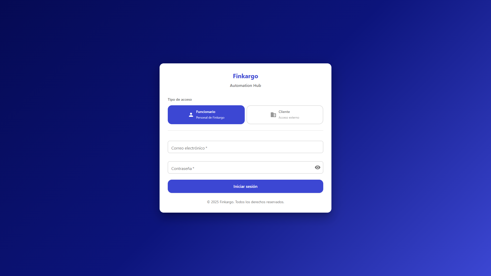

# Fraud Detection and Risk Department Module

**ADW ID:** fefa5443
**Date:** 2025-12-21
**Specification:** specs/issue-111-adw-fefa5443-fraud-detection-risk-module.md

## Overview

A comprehensive fraud detection system integrated into a new "Riesgos" (Risk) department within the Finkargo Automation Hub. This system automatically detects and prevents fraud attempts by validating identity consistency, email domains, NIT formats, and document authenticity. The module provides a complete risk management workflow including evaluation, scoring, alerts, blacklist management, and configuration.

## Screenshots




## What Was Built

- **New Risk Department** - "Riesgos" navigation section with role-based access for risk_analyst, risk_manager, and admin roles
- **Automated Fraud Detection Engine** - Validation services detecting identity inconsistencies, suspicious email domains (typosquatting detection), document authenticity issues, and NIT format violations
- **Risk Scoring System** - Weighted algorithm (0-100) with 4 risk levels: Low (0-30), Medium (31-60), High (61-80), Critical (81-100)
- **Risk Dashboard** - Main dashboard with metrics, evaluations table, alerts list, and blacklist management
- **Evaluation Detail Page** - Detailed view of risk assessments with fraud indicators breakdown and decision workflow
- **Configuration Panel** - Rule weight and threshold management for risk managers
- **Database Tables** - risk_assessments, fraud_detection_rules, risk_blacklist, risk_alerts with RLS policies
- **Alert System** - Automatic alert generation for high/critical risk evaluations

## Technical Implementation

### Files Modified

- `backend/main.py`: Registered risk routes router
- `backend/src/adapter/rest/rbac_dependencies.py`: Added risk role dependencies
- `frontend/src/App.tsx`: Added risk routes with role protection
- `frontend/src/components/ui/FKSidebar.tsx`: Added "Riesgos" navigation item
- `frontend/src/types/index.ts`: Added RISK_ANALYST and RISK_MANAGER to UserRole

### New Files Created

**Backend:**
- `backend/database/migration_add_risk_roles.sql` - Database migration for risk roles
- `backend/database/migration_create_risk_tables.sql` - Creates risk_assessments, fraud_detection_rules, risk_blacklist, risk_alerts tables
- `backend/src/adapter/rest/risk_routes.py` - 577 lines of REST API endpoints for risk management
- `backend/src/core/servicios/risk/__init__.py` - Risk services package exports
- `backend/src/core/servicios/risk/fraud_detection_service.py` - 636 lines of core fraud detection logic
- `backend/src/core/servicios/risk/risk_scoring_service.py` - 270 lines of weighted risk scoring algorithm
- `backend/src/core/servicios/risk/alert_service.py` - 230 lines of alert notification handling
- `backend/src/repositorio/risk_repository.py` - 621 lines of data access layer
- `backend/src/interface/risk_dtos.py` - 347 lines of Pydantic DTOs and enums
- `backend/tests/test_fraud_detection_service.py` - 366 lines of unit tests

**Frontend:**
- `frontend/src/pages/risk/RiskDashboard.tsx` - Main dashboard with tabs for evaluations, alerts, blacklist
- `frontend/src/pages/risk/RiskEvaluationDetail.tsx` - Detailed evaluation view with decision workflow
- `frontend/src/pages/risk/RiskConfiguration.tsx` - Rules and threshold configuration
- `frontend/src/components/risk/FKRiskScoreCard.tsx` - Risk score visualization with circular progress
- `frontend/src/components/risk/FKAlertList.tsx` - Active alerts display component
- `frontend/src/components/risk/FKRiskMetrics.tsx` - Dashboard metrics cards
- `frontend/src/components/risk/FKRiskEvaluationForm.tsx` - Evaluation trigger form
- `frontend/src/components/risk/FKBlacklistManager.tsx` - Blacklist CRUD management
- `frontend/src/services/riskService.ts` - API service layer for risk endpoints
- `frontend/src/types/risk.ts` - TypeScript types and configuration constants

### Key Changes

- **Fraud Detection Logic**: Implements 6 validation rules - identity consistency, email typosquatting detection (Levenshtein distance), Colombian NIT format validation, document metadata analysis, company history checks, and address verification
- **Weighted Risk Scoring**: Configurable weights per rule type (identity: 35%, email: 25%, documents: 20%, history: 10%, address: 10%) that normalize to a 0-100 score
- **Role-Based Access**: risk_analyst can view and create evaluations; risk_manager can additionally make decisions (approve/reject/escalate) and configure rules
- **Automatic Alerts**: High and Critical risk evaluations automatically generate alerts for the risk team

## How to Use

1. **Login** with a user that has `risk_analyst`, `risk_manager`, or `admin` role
2. **Navigate** to "Riesgos" in the sidebar menu
3. **View Dashboard** - See risk metrics, recent evaluations, active alerts, and blacklist entries
4. **Create Evaluation** - Click "Nueva Evaluacion" button, enter client NIT, submit to run fraud detection
5. **Review Results** - Click on an evaluation row to see detailed fraud indicators and risk score breakdown
6. **Make Decision** (risk_manager only) - Approve, reject, or escalate the evaluation with notes
7. **Configure Rules** (risk_manager only) - Navigate to Configuration tab to adjust rule weights and thresholds
8. **Manage Blacklist** - Add or remove entities (NITs, email domains, company names) from the blacklist

## Configuration

### Environment Variables
No new environment variables required. Uses existing Supabase configuration.

### Database Migrations
Apply migrations in order:
```bash
# 1. Add risk roles to user_profiles
psql -f backend/database/migration_add_risk_roles.sql

# 2. Create risk tables
psql -f backend/database/migration_create_risk_tables.sql
```

### Default Rule Weights
| Rule Type | Default Weight | Description |
|-----------|---------------|-------------|
| identity | 0.35 | Company name consistency across documents |
| email | 0.25 | Email domain typosquatting detection |
| document | 0.20 | Document metadata and authenticity |
| history | 0.10 | Company time in business |
| address | 0.10 | Address consistency verification |

### Risk Level Thresholds
| Level | Score Range | Action |
|-------|-------------|--------|
| Low | 0-30 | Auto-approve eligible |
| Medium | 31-60 | Manual review required |
| High | 61-80 | Detailed review + additional checks |
| Critical | 81-100 | Auto-reject + investigation |

## Testing

### Backend Unit Tests
```bash
cd backend && python -m pytest tests/test_fraud_detection_service.py -v
```

### Linting
```bash
cd backend && ruff check src/
cd frontend && npm run lint
```

### TypeScript Type Check
```bash
cd frontend && npx tsc --noEmit
```

### Frontend Build
```bash
cd frontend && npm run build
```

### E2E Test
See `.claude/commands/e2e/test_risk_dashboard.md` for E2E test specification.

## Notes

### Fraud Detection Capabilities
Based on the Azelis fraud case analysis, the system detects:
- **Identity Inconsistencies**: Different company names across documents (e.g., "ROCSA COLOMBIA S.A." vs "AZELIS COLOMBIA S.A.S.")
- **Email Typosquatting**: Similar but fake domains (e.g., "acelis.com.co" vs legitimate "azelis.com")
- **Invalid NIT Format**: Colombian tax ID validation with check digit verification
- **Suspicious TLDs**: Flags domains using .xyz, .top, .tk, etc.
- **Blacklisted Entities**: Immediate critical flag for known bad actors

### Future Enhancements
- ML-based pattern detection
- Document OCR integration (AWS Textract)
- DIAN (Colombian tax authority) NIT verification API
- Email/Slack notifications for critical alerts
- Batch evaluation from CSV upload
- Historical trend analysis charts

### Compliance
- All decisions logged with audit trail (assessed_by, reviewed_by, timestamps)
- Escalation workflow for false positive appeals
- Personal data minimization per Colombian Ley 1581 de 2012
