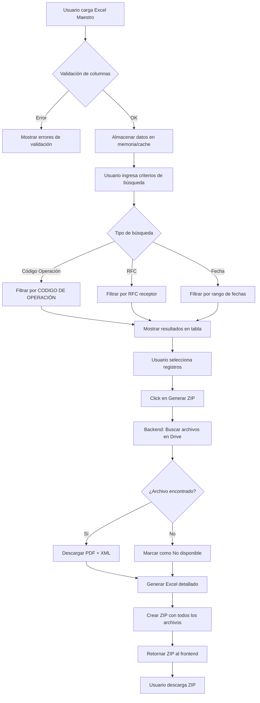

# Arquitectura - Automatización Facturación MX

## Resumen Ejecutivo

Esta funcionalidad automatiza el proceso de búsqueda de UUIDs en Google Drive y generación de paquetes ZIP con documentos fiscales (PDF/XML) para el equipo de Facturación México, reduciendo el tiempo de ~10 minutos a <1 minuto por solicitud.

---

## 1. Arquitectura General

### Diagrama de Flujo Completo



### Arquitectura de Capas (Clean Architecture)

```
┌─────────────────────────────────────────────────────────┐
│                    FRONTEND (React)                      │
│  ┌─────────────┐  ┌─────────────┐  ┌─────────────┐      │
│  │   Pages     │  │ Components  │  │  Services   │      │
│  │ (MX Report) │  │ (FK Forms)  │  │ (API calls) │      │
│  └─────────────┘  └─────────────┘  └─────────────┘      │
└─────────────────────────────────────────────────────────┘
                           │
                           ▼
┌─────────────────────────────────────────────────────────┐
│                    BACKEND (FastAPI)                     │
│                                                          │
│  ┌─────────────────────────────────────────────────┐    │
│  │              ADAPTER (REST Layer)                │    │
│  │  finance_routes.py - HTTP endpoints              │    │
│  └─────────────────────────────────────────────────┘    │
│                           │                              │
│  ┌─────────────────────────────────────────────────┐    │
│  │              CORE (Business Logic)               │    │
│  │  ┌─────────────┐ ┌─────────────┐ ┌───────────┐  │    │
│  │  │ExcelService │ │DriveService │ │ZipService │  │    │
│  │  └─────────────┘ └─────────────┘ └───────────┘  │    │
│  └─────────────────────────────────────────────────┘    │
│                           │                              │
│  ┌─────────────────────────────────────────────────┐    │
│  │            INTERFACE (DTOs/Contracts)            │    │
│  │  finance_dtos.py - Pydantic models               │    │
│  └─────────────────────────────────────────────────┘    │
└─────────────────────────────────────────────────────────┘
                           │
                           ▼
┌─────────────────────────────────────────────────────────┐
│                  EXTERNAL SERVICES                       │
│  ┌─────────────────┐  ┌─────────────────────────────┐   │
│  │  Google Drive   │  │  Supabase (Auth + Cache)    │   │
│  │  (Read-only)    │  │                             │   │
│  └─────────────────┘  └─────────────────────────────┘   │
└─────────────────────────────────────────────────────────┘
```

---

## 2. Estructura de Carpetas

### Backend

```
backend/src/
├── adapter/
│   └── rest/
│       ├── finance_routes.py          # NEW - Endpoints de facturación MX
│       └── ...
├── core/
│   └── servicios/
│       ├── excel_validation_service.py # NEW - Validación Excel maestro
│       ├── drive_service.py            # NEW - Conexión Google Drive
│       ├── zip_generator_service.py    # NEW - Generación de ZIP
│       ├── invoice_search_service.py   # NEW - Lógica de búsqueda
│       └── ...
├── interface/
│   ├── finance_dtos.py                 # NEW - DTOs de facturación MX
│   └── ...
└── config/
    ├── drive_config.py                 # NEW - Config Google Drive
    └── ...
```

### Frontend

```
frontend/src/
├── pages/
│   └── finance/
│       ├── ReporteriaAutomaticaCO.tsx  # Existente
│       └── ReporteriaAutomaticaMX.tsx  # NEW - Página principal MX
├── components/
│   └── forms/
│       ├── FKExcelUploader.tsx         # NEW - Carga de Excel
│       ├── FKInvoiceSearchForm.tsx     # NEW - Formulario de búsqueda
│       ├── FKInvoiceResultsTable.tsx   # NEW - Tabla de resultados
│       └── FKZipDownloadButton.tsx     # NEW - Botón descarga ZIP
├── services/
│   └── financeService.ts               # NEW - Llamadas API finance
└── types/
    └── finance.ts                      # NEW - Tipos TypeScript
```

---

## 3. Especificación de Endpoints

### Base URL: `/api/finance`

| Método | Endpoint | Descripción | Request | Response |
|--------|----------|-------------|---------|----------|
| POST | `/upload-excel` | Carga y valida Excel maestro | `multipart/form-data` | `ExcelValidationResponse` |
| POST | `/search` | Busca facturas según criterios | `InvoiceSearchRequest` | `InvoiceSearchResponse` |
| POST | `/generate-zip` | Genera ZIP con documentos | `ZipGenerationRequest` | `StreamingResponse (ZIP)` |
| GET | `/drive/status` | Verifica conexión a Drive | - | `DriveStatusResponse` |

### Detalle de Payloads

#### POST `/api/finance/upload-excel`

**Request (multipart/form-data):**
```
file: Excel file (.xlsx, .xls)
```

**Response (200 OK):**
```json
{
  "success": true,
  "total_rows": 150,
  "valid_rows": 148,
  "errors": [
    {
      "row": 45,
      "column": "UUID",
      "message": "UUID vacío o inválido"
    }
  ],
  "data": [
    {
      "uuid": "ABC123-456-789",
      "codigo_operacion": "OP-2024-001",
      "conceptos": "Servicios de importación",
      "fecha_emision": "2024-01-15",
      "rfc_receptor": "XAXX010101000",
      "razon_receptor": "Empresa SA de CV",
      "total": 15000.00
    }
  ],
  "session_id": "sess_abc123"
}
```

#### POST `/api/finance/search`

**Request:**
```json
{
  "session_id": "sess_abc123",
  "search_type": "codigo_operacion",  // "codigo_operacion" | "rfc" | "fecha"
  "codigo_operacion": "OP-2024-001",
  "rfc": null,
  "fecha_inicio": null,
  "fecha_fin": null
}
```

**Response (200 OK):**
```json
{
  "results": [
    {
      "uuid": "ABC123-456-789",
      "codigo_operacion": "OP-2024-001",
      "conceptos": "Servicios de importación",
      "fecha_emision": "2024-01-15",
      "rfc_receptor": "XAXX010101000",
      "razon_receptor": "Empresa SA de CV",
      "total": 15000.00,
      "clasificacion_gasto": "Comisiones"
    }
  ],
  "total_found": 5,
  "total_amount": 75000.00
}
```

#### POST `/api/finance/generate-zip`

**Request:**
```json
{
  "session_id": "sess_abc123",
  "uuids": ["ABC123-456-789", "DEF456-789-012"],
  "rfc_receptor": "XAXX010101000",
  "include_excel_detail": true
}
```

**Response (200 OK):**
```
Content-Type: application/zip
Content-Disposition: attachment; filename="Facturacion_XAXX010101000_2024-01-15.zip"
[Binary ZIP data]
```

**Response (206 Partial Content):** Si algunos archivos no se encontraron
```
Content-Type: application/zip
X-Missing-Files: ["UUID1", "UUID2"]
[Binary ZIP data with available files]
```

---

## 4. Modelos de Datos (DTOs)

### Backend - Pydantic Models

```python
# backend/src/interface/finance_dtos.py

from pydantic import BaseModel, Field, validator
from typing import List, Optional
from datetime import date
from enum import Enum

class SearchType(str, Enum):
    CODIGO_OPERACION = "codigo_operacion"
    RFC = "rfc"
    FECHA = "fecha"

class GastoClasificacion(str, Enum):
    INTERESES_PRESTAMO = "Intereses por Préstamo"
    COMISIONES = "Comisiones"
    HONORARIOS = "Honorarios"
    GASTOS_ADUANALES = "Gastos Aduanales"
    OTROS = "Otros"

class InvoiceRecord(BaseModel):
    uuid: str = Field(..., min_length=1, max_length=100)
    codigo_operacion: str = Field(..., min_length=1, max_length=50)
    conceptos: str = Field(..., max_length=500)
    fecha_emision: date
    rfc_receptor: str = Field(..., min_length=12, max_length=13)
    razon_receptor: str = Field(..., max_length=255)
    total: float = Field(..., ge=0)
    clasificacion_gasto: Optional[GastoClasificacion] = None

    @validator('rfc_receptor')
    def validate_rfc(cls, v):
        # Validación básica de RFC mexicano
        import re
        pattern = r'^[A-ZÑ&]{3,4}\d{6}[A-Z\d]{3}$'
        if not re.match(pattern, v.upper()):
            raise ValueError('RFC inválido')
        return v.upper()

class ExcelValidationError(BaseModel):
    row: int
    column: str
    message: str

class ExcelValidationResponse(BaseModel):
    success: bool
    total_rows: int
    valid_rows: int
    errors: List[ExcelValidationError]
    data: List[InvoiceRecord]
    session_id: str

class InvoiceSearchRequest(BaseModel):
    session_id: str
    search_type: SearchType
    codigo_operacion: Optional[str] = None
    rfc: Optional[str] = None
    fecha_inicio: Optional[date] = None
    fecha_fin: Optional[date] = None

    @validator('fecha_fin')
    def validate_date_range(cls, v, values):
        if v and values.get('fecha_inicio') and v < values['fecha_inicio']:
            raise ValueError('Fecha fin debe ser mayor a fecha inicio')
        return v

class InvoiceSearchResult(InvoiceRecord):
    archivo_estado: str = "Pendiente"  # "Disponible" | "No disponible" | "Pendiente"

class InvoiceSearchResponse(BaseModel):
    results: List[InvoiceSearchResult]
    total_found: int
    total_amount: float

class ZipGenerationRequest(BaseModel):
    session_id: str
    uuids: List[str] = Field(..., min_items=1)
    rfc_receptor: str
    include_excel_detail: bool = True

class DriveStatusResponse(BaseModel):
    connected: bool
    folder_id: str
    folder_name: str
    total_files: int
    last_sync: Optional[str] = None
```

### Frontend - TypeScript Types

```typescript
// frontend/src/types/finance.ts

export type SearchType = 'codigo_operacion' | 'rfc' | 'fecha';

export type GastoClasificacion =
  | 'Intereses por Préstamo'
  | 'Comisiones'
  | 'Honorarios'
  | 'Gastos Aduanales'
  | 'Otros';

export type ArchivoEstado = 'Disponible' | 'No disponible' | 'Pendiente';

export interface InvoiceRecord {
  uuid: string;
  codigo_operacion: string;
  conceptos: string;
  fecha_emision: string;
  rfc_receptor: string;
  razon_receptor: string;
  total: number;
  clasificacion_gasto?: GastoClasificacion;
}

export interface ExcelValidationError {
  row: number;
  column: string;
  message: string;
}

export interface ExcelValidationResponse {
  success: boolean;
  total_rows: number;
  valid_rows: number;
  errors: ExcelValidationError[];
  data: InvoiceRecord[];
  session_id: string;
}

export interface InvoiceSearchRequest {
  session_id: string;
  search_type: SearchType;
  codigo_operacion?: string;
  rfc?: string;
  fecha_inicio?: string;
  fecha_fin?: string;
}

export interface InvoiceSearchResult extends InvoiceRecord {
  archivo_estado: ArchivoEstado;
}

export interface InvoiceSearchResponse {
  results: InvoiceSearchResult[];
  total_found: number;
  total_amount: number;
}

export interface ZipGenerationRequest {
  session_id: string;
  uuids: string[];
  rfc_receptor: string;
  include_excel_detail: boolean;
}

export interface DriveStatusResponse {
  connected: boolean;
  folder_id: string;
  folder_name: string;
  total_files: number;
  last_sync?: string;
}
```

---

## 5. Servicios del Backend

### 5.1 ExcelValidationService

**Responsabilidad:** Validar estructura y datos del Excel maestro.

```python
# backend/src/core/servicios/excel_validation_service.py

class ExcelValidationService:
    REQUIRED_COLUMNS = [
        'UUID',
        'CODIGO DE OPERACIÓN',
        'Conceptos',
        'Fecha emision',
        'RFC receptor',
        'Razon receptor',
        'Total'
    ]

    async def validate_excel(self, file: UploadFile) -> ExcelValidationResponse:
        """
        Valida el Excel maestro y retorna los datos parseados.

        Args:
            file: Archivo Excel subido

        Returns:
            ExcelValidationResponse con datos validados y errores
        """
        pass

    def _validate_columns(self, df: pd.DataFrame) -> List[str]:
        """Verifica que existan todas las columnas requeridas."""
        pass

    def _validate_rows(self, df: pd.DataFrame) -> Tuple[List[InvoiceRecord], List[ExcelValidationError]]:
        """Valida cada fila y retorna registros válidos + errores."""
        pass
```

### 5.2 DriveService

**Responsabilidad:** Conectar y buscar archivos en Google Drive (read-only).

```python
# backend/src/core/servicios/drive_service.py

class DriveService:
    def __init__(self, credentials_path: str, folder_id: str):
        """
        Inicializa conexión con Google Drive.

        Args:
            credentials_path: Ruta al JSON de Service Account
            folder_id: ID de la carpeta de Drive a monitorear
        """
        pass

    async def check_connection(self) -> DriveStatusResponse:
        """Verifica estado de conexión a Drive."""
        pass

    async def search_files_by_uuid(self, uuid: str) -> Tuple[Optional[bytes], Optional[bytes]]:
        """
        Busca PDF y XML por UUID en Drive.

        Args:
            uuid: UUID del documento a buscar

        Returns:
            Tuple (pdf_bytes, xml_bytes) o (None, None) si no se encuentra
        """
        pass

    async def list_folder_contents(self) -> List[dict]:
        """Lista todos los archivos en la carpeta configurada."""
        pass
```

### 5.3 ZipGeneratorService

**Responsabilidad:** Generar ZIP con documentos y Excel detallado.

```python
# backend/src/core/servicios/zip_generator_service.py

class ZipGeneratorService:
    def __init__(self, drive_service: DriveService):
        self.drive_service = drive_service

    async def generate_zip(
        self,
        invoices: List[InvoiceRecord],
        rfc: str,
        include_excel: bool = True
    ) -> Tuple[bytes, List[str]]:
        """
        Genera ZIP con PDFs, XMLs y Excel detallado.

        Args:
            invoices: Lista de facturas a incluir
            rfc: RFC del receptor para nombre del archivo
            include_excel: Si incluir Excel detallado

        Returns:
            Tuple (zip_bytes, missing_uuids)
        """
        pass

    def _generate_detail_excel(
        self,
        invoices: List[InvoiceRecord],
        file_status: Dict[str, str]
    ) -> bytes:
        """
        Genera Excel con detalle de gastos.

        Incluye columnas:
        - UUID, Código Operación, Conceptos, Fecha, RFC, Razón Social
        - Total, Clasificación Gasto, Estado Archivo
        """
        pass

    def _create_zip_filename(self, rfc: str) -> str:
        """Genera nombre: Facturacion_[RFC]_[FECHA].zip"""
        pass
```

### 5.4 InvoiceSearchService

**Responsabilidad:** Lógica de búsqueda y filtrado de facturas.

```python
# backend/src/core/servicios/invoice_search_service.py

class InvoiceSearchService:
    # Cache en memoria para sesiones activas
    _sessions: Dict[str, List[InvoiceRecord]] = {}

    def store_session(self, session_id: str, data: List[InvoiceRecord]) -> None:
        """Almacena datos de Excel en caché de sesión."""
        pass

    def search(self, request: InvoiceSearchRequest) -> InvoiceSearchResponse:
        """
        Busca facturas según criterios.

        Soporta búsqueda por:
        - Código de operación (match exacto o parcial)
        - RFC receptor
        - Rango de fechas
        """
        pass

    def get_session_data(self, session_id: str) -> List[InvoiceRecord]:
        """Recupera datos de sesión del caché."""
        pass

    def clear_session(self, session_id: str) -> None:
        """Limpia datos de sesión expirada."""
        pass
```

---

## 6. Componentes del Frontend

### 6.1 FKExcelUploader

**Ubicación:** `frontend/src/components/forms/FKExcelUploader.tsx`

**Props:**
```typescript
interface FKExcelUploaderProps {
  onUploadSuccess: (response: ExcelValidationResponse) => void;
  onUploadError: (error: string) => void;
  maxSizeMB?: number;
  acceptedFormats?: string[];
}
```

**Funcionalidad:**
- Drag & drop zone para archivos
- Validación de formato (.xlsx, .xls)
- Validación de tamaño (default 10MB)
- Preview del nombre de archivo
- Indicador de progreso de carga
- Mostrar errores de validación

### 6.2 FKInvoiceSearchForm

**Ubicación:** `frontend/src/components/forms/FKInvoiceSearchForm.tsx`

**Props:**
```typescript
interface FKInvoiceSearchFormProps {
  sessionId: string;
  onSearch: (results: InvoiceSearchResponse) => void;
  onError: (error: string) => void;
  disabled?: boolean;
}
```

**Funcionalidad:**
- Selector de tipo de búsqueda (Código, RFC, Fecha)
- Campos dinámicos según tipo seleccionado
- Validación de RFC mexicano
- Date pickers para rango de fechas
- Botón de búsqueda con loading state

### 6.3 FKInvoiceResultsTable

**Ubicación:** `frontend/src/components/forms/FKInvoiceResultsTable.tsx`

**Props:**
```typescript
interface FKInvoiceResultsTableProps {
  results: InvoiceSearchResult[];
  onSelectionChange: (selectedUuids: string[]) => void;
  totalAmount: number;
}
```

**Funcionalidad:**
- Tabla con checkboxes para selección múltiple
- Columnas: UUID, Código Op., Fecha, RFC, Razón Social, Total, Estado
- Ordenamiento por columnas
- Paginación
- Chip de color para estado (Verde=Disponible, Rojo=No disponible)
- Footer con total seleccionado

### 6.4 FKZipDownloadButton

**Ubicación:** `frontend/src/components/forms/FKZipDownloadButton.tsx`

**Props:**
```typescript
interface FKZipDownloadButtonProps {
  sessionId: string;
  selectedUuids: string[];
  rfcReceptor: string;
  disabled?: boolean;
  onDownloadComplete: (missingFiles: string[]) => void;
  onError: (error: string) => void;
}
```

**Funcionalidad:**
- Botón deshabilitado si no hay selección
- Loading state durante generación
- Descarga automática del ZIP
- Mostrar alerta si hubo archivos faltantes

---

## 7. Asunciones para Preguntas Abiertas

Dado que hay preguntas pendientes, se asumen los siguientes valores por defecto:

### 1. Estructura de archivos en Drive
**Asunción:** Los archivos son **individuales** (no en ZIPs), organizados en **carpetas por año/mes**.

```
Drive/Facturas_MX/
├── 2024/
│   ├── 01_Enero/
│   │   ├── ABC123-456-789.pdf
│   │   ├── ABC123-456-789.xml
│   │   ├── DEF456-789-012.pdf
│   │   └── DEF456-789-012.xml
│   └── 02_Febrero/
│       └── ...
└── 2025/
    └── ...
```

**Nomenclatura esperada:** `{UUID}.pdf` y `{UUID}.xml`

### 2. Moneda
**Confirmado:** Todos los montos en el Excel están en **USD**. No se requiere conversión de moneda.

### 3. Clasificación de gastos
**Asunción:** La clasificación se infiere del campo "Conceptos" usando keywords:

| Keyword | Clasificación |
|---------|--------------|
| "interés", "intereses", "préstamo" | Intereses por Préstamo |
| "comisión", "comisiones" | Comisiones |
| "honorario", "honorarios" | Honorarios |
| "aduana", "aduanal" | Gastos Aduanales |
| (default) | Otros |

---

## 8. Dependencias Nuevas

### Backend (agregar a requirements.txt)

```txt
# Excel processing
pandas==2.1.4
openpyxl==3.1.2
xlrd==2.0.1

# Google Drive API
google-api-python-client==2.111.0
google-auth==2.25.2
google-auth-httplib2==0.2.0
google-auth-oauthlib==1.2.0

# ZIP handling (stdlib, no requiere instalación)
# zipfile, io - ya incluidos en Python
```

### Frontend
No se requieren nuevas dependencias. Todo está cubierto por MUI, Axios y date-fns.

---

## 9. Variables de Entorno

### Backend (.env)

```bash
# Google Drive Configuration
GOOGLE_DRIVE_CREDENTIALS_PATH=./credentials/drive_service_account.json
GOOGLE_DRIVE_FOLDER_ID=your_folder_id_here
GOOGLE_DRIVE_SCOPES=["https://www.googleapis.com/auth/drive.readonly"]

# Session Cache Configuration
SESSION_CACHE_TTL_MINUTES=30
MAX_EXCEL_FILE_SIZE_MB=10
MAX_ZIP_SIZE_MB=50

# Invoice Processing
SUPPORTED_INVOICE_FORMATS=[".xlsx",".xls"]
```

### Frontend (.env)
No se requieren nuevas variables para esta funcionalidad.

---

## 10. Consideraciones de Seguridad

1. **Google Drive Service Account**: Usar cuenta de servicio con permisos read-only únicamente
2. **Validación de archivos**: Verificar MIME type y tamaño antes de procesar
3. **Sanitización de UUIDs**: Validar formato antes de buscar en Drive
4. **CORS**: Asegurar que solo el frontend autorizado pueda acceder
5. **Rate limiting**: Limitar peticiones de generación de ZIP (1 por minuto por usuario)
6. **Cleanup**: Limpiar archivos temporales después de generar ZIP

---

## 11. Plan de Implementación por Sprints

### Sprint 1: Carga de Excel + Validación (3-5 días)

**Backend:**
- [ ] Crear `finance_dtos.py` con todos los modelos Pydantic
- [ ] Implementar `ExcelValidationService`
- [ ] Crear endpoint `POST /api/finance/upload-excel`
- [ ] Implementar `InvoiceSearchService` (almacenamiento en memoria)
- [ ] Agregar `finance_routes.py` al router principal
- [ ] Tests unitarios para validación de Excel

**Frontend:**
- [ ] Crear tipos en `types/finance.ts`
- [ ] Implementar `FKExcelUploader` component
- [ ] Crear `financeService.ts` con método `uploadExcel`
- [ ] Crear página `ReporteriaAutomaticaMX.tsx` básica
- [ ] Integrar uploader con página
- [ ] Mostrar errores de validación

### Sprint 2: Búsqueda + Conexión Drive (4-6 días)

**Backend:**
- [ ] Implementar `DriveService` con Google API
- [ ] Crear endpoint `GET /api/finance/drive/status`
- [ ] Crear endpoint `POST /api/finance/search`
- [ ] Agregar lógica de clasificación de gastos
- [ ] Tests de integración con Drive (mock)

**Frontend:**
- [ ] Implementar `FKInvoiceSearchForm` component
- [ ] Implementar `FKInvoiceResultsTable` component
- [ ] Agregar métodos `search` y `checkDriveStatus` a service
- [ ] Integrar búsqueda con página principal
- [ ] Mostrar resultados en tabla con selección

### Sprint 3: Generación ZIP + Excel Detallado (4-5 días)

**Backend:**
- [ ] Implementar `ZipGeneratorService`
- [ ] Crear endpoint `POST /api/finance/generate-zip`
- [ ] Generar Excel detallado con openpyxl
- [ ] Manejar archivos faltantes (marcar como "No disponible")
- [ ] StreamingResponse para descarga de ZIP
- [ ] Tests E2E del flujo completo

**Frontend:**
- [ ] Implementar `FKZipDownloadButton` component
- [ ] Agregar método `generateZip` a service
- [ ] Manejar descarga de archivo blob
- [ ] Mostrar alerta de archivos faltantes
- [ ] Polish UI y loading states

### Post-Sprint: Mejoras y Deploy

- [ ] Optimización de performance
- [ ] Logging y monitoreo
- [ ] Documentación de API
- [ ] Deploy a staging
- [ ] Testing con usuarios reales
- [ ] Deploy a producción

---

## 12. Archivos a Crear

| Archivo | Tipo | Sprint |
|---------|------|--------|
| `backend/src/interface/finance_dtos.py` | DTO | 1 |
| `backend/src/core/servicios/excel_validation_service.py` | Service | 1 |
| `backend/src/core/servicios/invoice_search_service.py` | Service | 1 |
| `backend/src/adapter/rest/finance_routes.py` | Route | 1 |
| `backend/src/core/servicios/drive_service.py` | Service | 2 |
| `backend/src/config/drive_config.py` | Config | 2 |
| `backend/src/core/servicios/zip_generator_service.py` | Service | 3 |
| `frontend/src/types/finance.ts` | Type | 1 |
| `frontend/src/services/financeService.ts` | Service | 1 |
| `frontend/src/pages/finance/ReporteriaAutomaticaMX.tsx` | Page | 1 |
| `frontend/src/components/forms/FKExcelUploader.tsx` | Component | 1 |
| `frontend/src/components/forms/FKInvoiceSearchForm.tsx` | Component | 2 |
| `frontend/src/components/forms/FKInvoiceResultsTable.tsx` | Component | 2 |
| `frontend/src/components/forms/FKZipDownloadButton.tsx` | Component | 3 |

---

## 13. Próximos Pasos

1. **Confirmar asunciones** sobre estructura de Drive y conversión MXN
2. **Obtener credenciales** de Google Drive Service Account
3. **Definir carpeta exacta** de Drive a monitorear
4. **Comenzar Sprint 1** con la carga y validación de Excel

---

## Notas Adicionales

- El sistema usa caché en memoria para sesiones. En producción, considerar Redis para persistencia entre restarts.
- Los ZIPs grandes (>50MB) podrían requerir generación asíncrona con notificación.
- Considerar agregar preview de archivos antes de generar ZIP.
